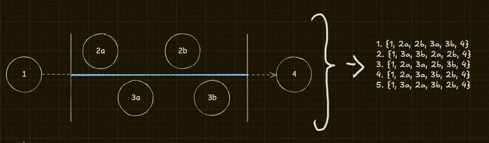

# O que é concorrência?

## E porque não é paralelismo?

Concorrência tem as seguintes características mais comuns:

- Não é determinística
- Não é sequencial
- Fora de ordem
- Ordem parcial

## Primeiro processador multi core
- 2009 - Intel Core2Duo

Troca de contexto de várias tarefas
Co-rotinas
Scheduler/Agendador
Pausa => Operação de `yield` (retorna o controle para o scheduler)

Multitarefas cooperativas
- Co-rotinas
- Scheduler/Agendador

Multitarefas preemptiva
- OS interrompe as tarefas para executar outras

## O que é uma COROTINA?

- Parte do programa podem ser executadas de forma independente
- Podem rodar em núcleos diferentes, nesse caso, seriam executadas em paralelo (ao mesmo tempo)
- Paralelismo depende de múltiplos cores, concorrência não

## Problemas com concorrência
- A alternância entre contexto a todo tempo tem um custo.
- Um programa muito concorrente em um único núcleo, pode deixar o programa mais lento.
- Paaralelismo e concorrência não são balas de prata
- Para ter paralelismo é necessário ter concorrência, pois concorrência se trata dee como o seu programa vai se comportar

Subrotinas => Co-rotinas => Paralelismo => Concorrência (e paralelismo)

Problemas conhecidos:

- Race Conditions
- Deadlocks
- Leak de rotinas

Assuntos:
- Channels e Mutex
